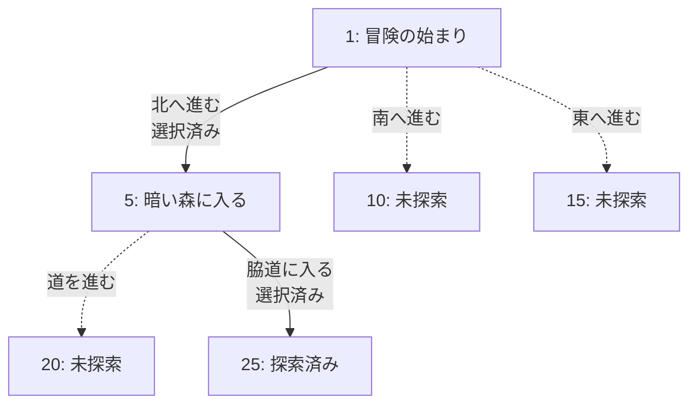

# ゲームブック記録支援ツール仕様書

## 1. プロジェクト概要

### 目的
ファイティングファンタジーなどのゲームブックプレイ時に、訪れたパラグラフの記録と選択の追跡を支援し、ゲームブックの全貌を解明することを目的とした可視化ツール。リプレイ記録ではなく、複数回のプレイを通じてゲームブックの構造を完全に把握することを主眼とする。

### 主要機能
- パラグラフ番号を主キーとした記録管理
- 選択肢の追跡（選んだ選択肢・選ばなかった選択肢）
- テキストベースの2Dマップ生成
- パラグラフ遷移のフロー図生成
- 音声入力サポート

## 2. 機能要件

### 2.1 データ記録機能

#### 記録する情報
- **パラグラフ番号**（主キー）
- **パラグラフ概要**
- **選択肢情報**
  - すべての選択肢（戦闘の勝敗、アイテムの有無なども選択肢として扱う）
  - 各選択肢の遷移先パラグラフ番号
  - 選択済み/未選択の状態
  - 選択肢の総数（入力負荷軽減時は数値のみ記録も可）
- **マップ上の位置**（複数パラグラフが同じ位置に対応する可能性あり）

#### 複数ゲーム対応
- 複数のゲームブックを切り替えてプレイ可能
- 各ゲームのデータは独立して管理

### 2.2 可視化機能

#### PTerm統合可視化システム（v0.2.0で完成）
- **Tree Printer**: パラグラフ遷移の階層表示
  - 選択肢情報の完全表示（[✓]/[ ]シンボル）
  - 選択済み/未選択の明確な視覚的区別
  - 階層表示による分岐構造の明確化
  - リアルタイム更新対応
- **Area Printer**: 格子状マップ表示
  - ASCII文字を使用した格子状マップ
  - 選択位置の動的ハイライト
  - ヒートマップ機能（訪問済み/未訪問の視覚化）
- **統合UI**: 3分割レイアウト
  - 左側マップ・右側フロー図・下部メニュー
  - リアルタイムナビゲーション

#### フロー図の高度な機能
- **グラフ接続性分析**（v0.2.3で実装予定）
  - 段階的表示システム：接続のみ（デフォルト）→ 全て（管理用）→ 非表示（クリーン）
  - 未定義移動先選択肢のフィルタリング
  - TreePrinterの無差別表示による実用性破綻の解決
- **スケーラビリティ対応**（v0.2.4で実装予定）
  - 大規模ゲームブック対応（100パラグラフ以上）
  - 分割表示とナビゲーション機能
  - パフォーマンス最適化

#### テキストベース2Dマップ（v0.5.0で再設計予定）
- **東西南北の方向概念を反映**
- パラグラフ番号のみを表示（フロー図で詳細を表現）
- 複数のパラグラフが同じマップ位置に対応可能
- 自動配置を優先（困難な場合は手動入力しやすいフォーマットを確立）
- 例：
```
+---+---+---+
| 1 |   | 5 |
+---+---+---+
| 2 | 3 | 4 |
+---+---+---+
```

### 2.3 入力機能

#### 現在の入力システム（v0.2.0で完成）
- **PTerm対話シェル（REPLモード）**
  - リッチなターミナルUI（色付き、テーブル、メニュー選択）
  - 現在の状態の自動表示（統計情報、パラグラフ情報）
  - 利用頻度に基づく最適化されたメニュー順序
  - 10行表示による快適なメニュー操作
- **CLIコマンド互換性**
  - 既存CLIコマンドとの完全互換性
  - バッチ処理対応

#### 入力支援機能（v0.2.5で実装予定）
- **Tab補完・候補表示・半透明ヒント**
  - 入力効率の大幅向上
  - ユーザビリティ向上
  - 入力ミス防止

#### 音声入力（v1.0.0で実装予定）
- 一文形式での入力（例：「パラグラフ1、村の入り口、北へ進む」）
- 入力直後にリアルタイムで確認・修正
- 対象：パラグラフ番号、概要、選択肢
- 優先度：パラグラフ番号と概要の認識精度を重視
- 手動入力との併用可能

#### スマートフォン連携（v0.4.0で実装予定）
- **WebUI実装によるハンズフリー操作**
- スマートフォンからの音声入力
- リアルタイム同期機能

### 2.4 データ管理

#### 保存形式
- Markdown形式（人間が読みやすい）
- Gitリポジトリでの管理を前提

#### データ構造例

**パラグラフ記録（Markdown）**
```markdown
# ゲームブック名

## パラグラフ 1
- 概要：冒険の始まり
- 選択肢：
  - [x] 北へ進む → 5
  - [ ] 南へ進む → 10
  - [ ] 東へ進む → 15
  - [ ] 鍵を持っている → 20
  - [ ] 鍵を持っていない → 25

## パラグラフ 5
- 概要：暗い森に入る
- 選択肢：
  - [ ] 道を進む → 20
  - [x] 脇道に入る → 25
```

**パラグラフ遷移図（Mermaid記法）**


**ネットワーク関係の記録形式**
```
# 遷移記録
1 --> 5  (北へ進む) [選択済み]
1 --> 10 (南へ進む) [未選択]
1 --> 15 (東へ進む) [未選択]
5 --> 20 (道を進む) [未選択]
5 --> 25 (脇道に入る) [選択済み]
```

## 3. 非機能要件

### 3.1 プラットフォーム
- Windows（WSL含む）
- macOS
- Linux

### 3.2 開発言語
- Go言語

### 3.3 インターフェース
- **CLI（コマンドライン）** - 基本インターフェース ✅ **完成**
- **PTerm対話シェル** - リッチなターミナルUI ✅ **完成**
- **WebUI** - スマートフォン連携用（v0.4.0で実装予定）

### 3.4 パフォーマンス
- 1セッション（1-2時間）のプレイでスムーズに動作
- リアルタイムでの図の更新

### 3.5 エラー処理
- **パラグラフ番号の重複検出** ✅ **完成**
- **未定義の遷移先への警告** ✅ **完成**
- **エラーは即座に通知**（その場で確認） ✅ **完成**
- **グラフ接続性分析**（v0.2.3で強化予定）
  - 未定義移動先選択肢のフィルタリング
  - TreePrinterの無差別表示による実用性破綻の解決

## 4. 制約事項

### 4.1 データ共有
- Gitリポジトリを通じた共有のみ
- 専用のクラウド同期機能は実装しない

### 4.2 マップ表現
- **テキストベースのみ**（画像生成は行わない）
- **PTerm統合可視化システム**で実装済み ✅ **完成**
- **東西南北対応マップ機能**（v0.5.0で再設計予定）
  - 方向概念とマップ座標系の実装
  - 2Dマップ機能の完全実装

## 5. 実装の優先順位

### 5.1 必須機能（最初のバージョン） ✅ **完成**
- 基本的な記録機能（パラグラフ、選択肢） ✅ **完成**
- フロー図のリアルタイム出力 ✅ **完成**
- エラー検出と即時通知 ✅ **完成**

### 5.2 完了済み機能
- **PTerm対話シェル** ✅ **完成**（v0.1.5）
- **統合可視化システム** ✅ **完成**（v0.2.0）
- **段落順序依存問題の解消** ✅ **完成**（v0.2.1）
- **フロー図の視認性改善** ✅ **完成**（v0.2.2）

### 5.3 実装予定機能
- **グラフ接続性分析**（v0.2.3で実装中）
- **スケーラビリティ対応**（v0.2.4で実装予定）
- **入力支援機能**（v0.2.5で実装予定）
- **プレイヤーシート機能**（v0.3.1で実装予定）
- **WebUI・スマートフォン連携**（v0.4.0で実装予定）
- **東西南北対応マップ機能**（v0.5.0で実装予定）
- **音声入力機能**（v1.0.0で実装予定）

## 6. マイルストーン

### v0.1.0 - 基本機能完成 ✅ **完成**
- 5.1「必須機能（最初のバージョン）」に基づく
- 基本的な記録機能、フロー図のリアルタイム出力、エラー検出と即時通知

### v0.1.5 - 対話モード機能追加 ✅ **完成**
- **ユーザビリティの大幅向上**
- **PTerm対話シェル（REPLモード）の実装**
  - リッチなターミナルUI（色付き、テーブル、メニュー選択）
  - 現在の状態の自動表示（統計情報、パラグラフ情報）
  - 利用頻度に基づく最適化されたメニュー順序
  - 10行表示による快適なメニュー操作
- **CLIラッパーアーキテクチャ**
  - 二重実装の回避（CommandExecutorパターン）
  - 既存CLIコマンドとの完全互換性
- **テスト駆動開発（TDD）の復活**
  - 完全なテストカバレッジ
  - MockExecutorによる単体テスト

### v0.2.0 - 可視化機能完成 ✅ **完成**
- 2.2「可視化機能」に基づく
- **PTerm統合可視化システム**の実装
- **動的フロー表示**: Tree Printerによるパラグラフ遷移の階層表示、リアルタイム更新
- **インタラクティブ2Dマップ**: Area Printerによる格子状マップ表示、選択位置の動的ハイライト
- **統合UI**: 左側マップ・右側フロー図・下部メニューの3分割レイアウト
- **ヒートマップ機能**: 訪問済み/未訪問パラグラフの視覚的表現
- **リアルタイムナビゲーション**: 選択に応じた即座の表示更新
- **クロスプラットフォーム対応**: Windows/macOS/Linux全環境での統一体験

### v0.2.1 - 段落順序依存問題の解消 ✅ **完成**
- プレイテスターフィードバック対応（最高優先）
- 段落の作成順序に依存しない自然な記録順序の実現
- 複数パラグラフの同時記録と選択肢の後付け追加対応

### v0.2.2 - フロー図の視認性改善 ✅ **完成**
- フロー図での選択肢情報の完全表示
- 選択済み/未選択の明確な視覚的区別（[✓]/[ ]シンボル）
- 階層表示による分岐構造の明確化
- プレイヤビリティの大幅向上

### v0.2.3 - 段落順序依存問題の解決 🔄 **実装中**
- 未定義移動先選択肢の暫定対応（Issue #57）
- グラフ接続性分析とフィルタリング表示システム
- 段階的表示システム：接続のみ（デフォルト）→ 全て（管理用）→ 非表示（クリーン）
- TreePrinterの無差別表示による実用性破綻の解決

### v0.2.4 - フロー図スケーラビリティ対応 📋 **計画中**
- 大規模ゲームブック対応（Issue #58）
- 100パラグラフ以上での視認性維持
- 分割表示とナビゲーション機能
- パフォーマンス最適化

### v0.2.5 - 入力支援機能実装 📋 **計画中**
- Tab補完・候補表示・半透明ヒント（Issue #59）
- 入力効率の大幅向上
- ユーザビリティ向上

### v0.2.6 - 直接移動パラグラフ可視化対応 📋 **計画中**
- moveコマンド対応（Issue #60）
- 直接移動パラグラフの可視化
- 複雑な移動パターンの表現

### v0.3.0 - 操作性の大幅改善 📋 **計画中**
- コマンド短縮とショートカット強化（Issue #44）
- プレイテスターフィードバック対応
- 操作効率の向上

### v0.3.1 - プレイヤーシート機能実装 📋 **計画中**
- 体力・技量・運・金貨・アイテム管理（Issue #61）
- ゲームブック固有の数値管理
- 状態追跡機能

### v0.4.0 - スマートフォン連携 📋 **計画中**
- WebUI実装によるハンズフリー操作（Issue #45）
- スマートフォンからの音声入力
- リアルタイム同期機能

### v0.5.0 - 東西南北対応マップ機能の再設計 📋 **計画中**
- 方向概念とマップ座標系の実装（Issue #47）
- 2Dマップ機能の完全実装
- 空間的配置の視覚化

### v1.0.0 - 音声入力機能完成 📋 **計画中**
- 2.3「入力機能」・5.2「後回し可能な機能」に基づく
- 音声入力、Web版インターフェース、ユーザビリティ向上

## 7. 今後の検討事項

### 7.1 技術的課題
- **音声認識エンジンの選定**（v1.0.0に向けて）
- **テキストベースマップの具体的な表現方法**（v0.5.0に向けて）
  - 東西南北の反映方法
  - 複数パラグラフが同じマップ位置に対応する場合の表示方法
  - 「戻る」選択肢のマップ上での表現方法
- **WebUI技術スタックの選定**（v0.4.0に向けて）
  - Go WebフレームワークvsReact/Vue.js
  - リアルタイム同期方式（WebSocket vs Server-Sent Events）

### 7.2 ユーザビリティ向上
- **プレイテスターフィードバック継続収集**
- **入力支援機能の詳細設計**（v0.2.5に向けて）
- **プレイヤーシート機能の設計**（v0.3.1に向けて）
  - 体力・技量・運・金貨・アイテムの管理方法
  - ゲームブック固有の数値追跡

### 7.3 スケーラビリティ対応
- **大規模ゲームブック対応**（v0.2.4に向けて）
  - 100パラグラフ以上での視認性維持
  - 分割表示とナビゲーション機能
  - パフォーマンス最適化

### 7.4 将来の拡張性
- **マルチプラットフォーム対応**
- **クラウド同期機能**（制約事項との兼ね合い）
- **ゲームブック作成支援機能**（作家向け）

## 8. 参考資料

### 8.1 プロジェクト管理
- **GitHub Issues**: 全作業の追跡管理
- **CLAUDE.md**: AI開発最適化指示
- **DEVELOPMENT.md**: 開発方針・TDD徹底

### 8.2 技術仕様
- **Go言語**: クロスプラットフォーム対応
- **PTerm**: リッチターミナルUI
- **Markdown**: 人間が読みやすいデータ形式
- **Git**: バージョン管理・データ共有