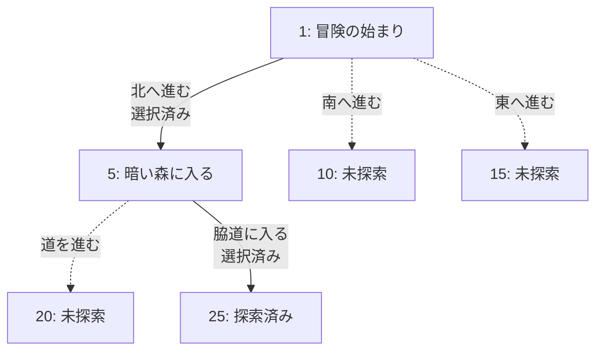

# ゲームブック記録支援ツール仕様書

## 1. プロジェクト概要

### 目的
ファイティングファンタジーなどのゲームブックプレイ時に、訪れたパラグラフの記録と選択の追跡を支援し、ゲームブックの全貌を解明することを目的とした可視化ツール。リプレイ記録ではなく、複数回のプレイを通じてゲームブックの構造を完全に把握することを主眼とする。

### 主要機能
- パラグラフ番号を主キーとした記録管理
- 選択肢の追跡（選んだ選択肢・選ばなかった選択肢）
- テキストベースの2Dマップ生成
- パラグラフ遷移のフロー図生成
- 音声入力サポート

## 2. 機能要件

### 2.1 データ記録機能

#### 記録する情報
- **パラグラフ番号**（主キー）
- **パラグラフ概要**
- **選択肢情報**
  - すべての選択肢（戦闘の勝敗、アイテムの有無なども選択肢として扱う）
  - 各選択肢の遷移先パラグラフ番号
  - 選択済み/未選択の状態
  - 選択肢の総数（入力負荷軽減時は数値のみ記録も可）
- **マップ上の位置**（複数パラグラフが同じ位置に対応する可能性あり）

#### 複数ゲーム対応
- 複数のゲームブックを切り替えてプレイ可能
- 各ゲームのデータは独立して管理

### 2.2 可視化機能

#### テキストベース2Dマップ
- ASCII文字を使用した格子状マップ
- **東西南北の方向概念を反映**
- パラグラフ番号のみを表示（フロー図で詳細を表現）
- 複数のパラグラフが同じマップ位置に対応可能
- 自動配置を優先（困難な場合は手動入力しやすいフォーマットを確立）
- 例：
```
+---+---+---+
| 1 |   | 5 |
+---+---+---+
| 2 | 3 | 4 |
+---+---+---+
```

#### フロー図
- パラグラフの遷移を表示
- 選択の分岐を可視化
- 合流点の明示（異なる選択が同じパラグラフに到達する場合）
- Mermaid記法での出力を検討
- リアルタイム更新

### 2.3 入力機能

#### 音声入力
- 一文形式での入力（例：「パラグラフ1、村の入り口、北へ進む」）
- 入力直後にリアルタイムで確認・修正
- 対象：パラグラフ番号、概要、選択肢
- 優先度：パラグラフ番号と概要の認識精度を重視
- 手動入力との併用可能

#### 手動入力
- キーボードによる直接入力
- 音声入力の修正・補完用

### 2.4 データ管理

#### 保存形式
- Markdown形式（人間が読みやすい）
- Gitリポジトリでの管理を前提

#### データ構造例

**パラグラフ記録（Markdown）**
```markdown
# ゲームブック名

## パラグラフ 1
- 概要：冒険の始まり
- 選択肢：
  - [x] 北へ進む → 5
  - [ ] 南へ進む → 10
  - [ ] 東へ進む → 15
  - [ ] 鍵を持っている → 20
  - [ ] 鍵を持っていない → 25

## パラグラフ 5
- 概要：暗い森に入る
- 選択肢：
  - [ ] 道を進む → 20
  - [x] 脇道に入る → 25
```

**パラグラフ遷移図（Mermaid記法）**


**ネットワーク関係の記録形式**
```
# 遷移記録
1 --> 5  (北へ進む) [選択済み]
1 --> 10 (南へ進む) [未選択]
1 --> 15 (東へ進む) [未選択]
5 --> 20 (道を進む) [未選択]
5 --> 25 (脇道に入る) [選択済み]
```

## 3. 非機能要件

### 3.1 プラットフォーム
- Windows（WSL含む）
- macOS
- Linux

### 3.2 開発言語
- Go言語

### 3.3 インターフェース
- CLI（コマンドライン）を基本とする
- Web版も検討（図の出力が容易な場合）

### 3.4 パフォーマンス
- 1セッション（1-2時間）のプレイでスムーズに動作
- リアルタイムでの図の更新

### 3.5 エラー処理
- パラグラフ番号の重複検出
- 未定義の遷移先への警告
- エラーは即座に通知（その場で確認）

## 4. 制約事項

### 4.1 データ共有
- Gitリポジトリを通じた共有のみ
- 専用のクラウド同期機能は実装しない

### 4.2 マップ表現
- テキストベースのみ（画像生成は行わない）
- Mermaid記法ではマップ表現に制限があるため、独自のテキスト表現を検討

## 5. 実装の優先順位

### 5.1 必須機能（最初のバージョン）
- 基本的な記録機能（パラグラフ、選択肢）
- フロー図のリアルタイム出力
- エラー検出と即時通知

### 5.2 後回し可能な機能
- 音声入力機能
- マップの自動生成と出力

## 6. マイルストーン

### v0.1.0 - 基本機能完成
- 5.1「必須機能（最初のバージョン）」に基づく
- 基本的な記録機能、フロー図のリアルタイム出力、エラー検出と即時通知

### v0.1.5 - 対話モード機能追加 ✅ **完成**
- **ユーザビリティの大幅向上**
- **PTerm対話シェル（REPLモード）の実装**
  - リッチなターミナルUI（色付き、テーブル、メニュー選択）
  - 現在の状態の自動表示（統計情報、パラグラフ情報）
  - 利用頻度に基づく最適化されたメニュー順序
  - 10行表示による快適なメニュー操作
- **CLIラッパーアーキテクチャ**
  - 二重実装の回避（CommandExecutorパターン）
  - 既存CLIコマンドとの完全互換性
- **テスト駆動開発（TDD）の復活**
  - 完全なテストカバレッジ
  - MockExecutorによる単体テスト

### v0.2.0 - 可視化機能完成  
- 2.2「可視化機能」に基づく
- **PTerm統合可視化システム**の実装
- **動的フロー表示**: Tree Printerによるパラグラフ遷移の階層表示、リアルタイム更新
- **インタラクティブ2Dマップ**: Area Printerによる格子状マップ表示、選択位置の動的ハイライト
- **統合UI**: 左側マップ・右側フロー図・下部メニューの3分割レイアウト
- **ヒートマップ機能**: 訪問済み/未訪問パラグラフの視覚的表現
- **リアルタイムナビゲーション**: 選択に応じた即座の表示更新
- **クロスプラットフォーム対応**: Windows/macOS/Linux全環境での統一体験

### v1.0.0 - 音声入力機能完成
- 2.3「入力機能」・5.2「後回し可能な機能」に基づく
- 音声入力、Web版インターフェース、ユーザビリティ向上

## 7. 今後の検討事項

- 音声認識エンジンの選定
- テキストベースマップの具体的な表現方法（東西南北の反映方法）
- 複数パラグラフが同じマップ位置に対応する場合の表示方法
- 「戻る」選択肢のマップ上での表現方法
- Mermaid以外のフロー図記法の検討（必要に応じて）