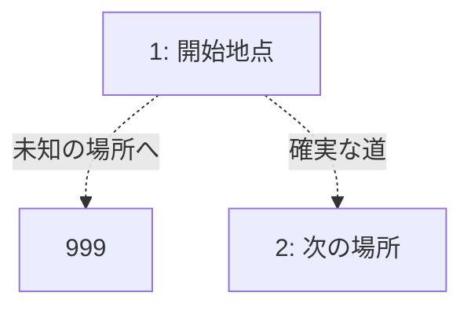

# 警告テスト

## パラグラフ 1
- 概要：開始地点
- 選択肢：
  - [ ] 未知の場所へ → 999
  - [ ] 確実な道 → 2

## パラグラフ 2
- 概要：次の場所

## フロー図

```mermaid
graph TD
    1[1: 開始地点]
    2[2: 次の場所]

    1 -.->|未知の場所へ| 999
    1 -.->|確実な道| 2
```
