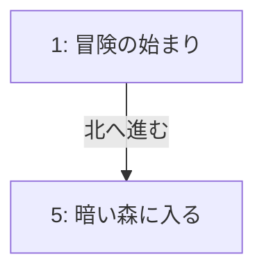

# Interface Adapters Layer 仕様書

## 概要
外部システムとの接続、データ永続化、入出力変換の仕様

## Repository（データ永続化）

### MarkdownRepository
ゲームブックデータをMarkdown形式で保存・読み込み

#### ファイル構造
```
data/
├── .current_game    # 現在のゲーム名
├── GameTitle1.md    # ゲームブックデータ
├── GameTitle2.md    # ゲームブックデータ
└── session/         # セッションデータ
```

#### Markdownフォーマット
```markdown
# ゲームブック名

## パラグラフ 1
- 概要：冒険の始まり
- 選択肢：
  - [x] 北へ進む → 5
  - [ ] 南へ進む → 10
```

#### 機能
- Load: ゲームブックの読み込み
- Save: ゲームブックの保存
- List: ゲームブック一覧取得
- LoadCurrentGame: 現在のゲーム名取得
- SaveCurrentGame: 現在のゲーム名保存

### SessionRepository
プレイセッションの履歴を管理

#### セッションフォーマット
```
2025-01-06 10:00:00: 1 → 5 → 10 → 15
```

## Presenter（出力フォーマット）

### TreePrinter
フロー図の階層表示

#### 出力形式
```
パラグラフ 1: 冒険の始まり
├── [✓] 北へ進む → 5
│   └── パラグラフ 5: 暗い森
└── [ ] 南へ進む → 10
```

### AreaPrinter
2Dマップ表示

#### 出力形式
```
+---+---+---+
| 1 |   | 5 |
+---+---+---+
| 2 | 3 | 4 |
+---+---+---+
```

### MermaidGenerator
Mermaid形式のフロー図生成

#### 出力形式


## Controller（入力処理）

### CLIController
コマンドライン引数の解析と処理

#### コマンド一覧
- new: 新規ゲームブック作成
- add: パラグラフ追加
- choice: 選択肢追加
- select: 選択肢選択
- move: 直接移動
- show: 現在状態表示
- list: ゲームブック一覧
- switch: ゲーム切り替え

### InteractiveController
対話型インターフェースの制御

#### メニュー構造
1. パラグラフを追加
2. 選択肢を追加
3. 選択肢を選択
4. 現在の状態を表示
5. 直接移動
6. ゲームを切り替え
7. 終了

## 入力支援

### InputHelper
ユーザー入力の支援機能

#### 機能
- デフォルト値表示: 現在位置をプレースホルダーとして表示
- 空入力処理: Enterのみで現在位置を自動入力
- 入力検証: 数値変換とエラーハンドリング

## エラー処理

### エラーメッセージ
- ファイル読み込みエラー
- ファイル書き込みエラー
- パース処理エラー
- 入力検証エラー

### リカバリー処理
- 自動バックアップ
- 破損データの部分読み込み
- エラー時の状態復元